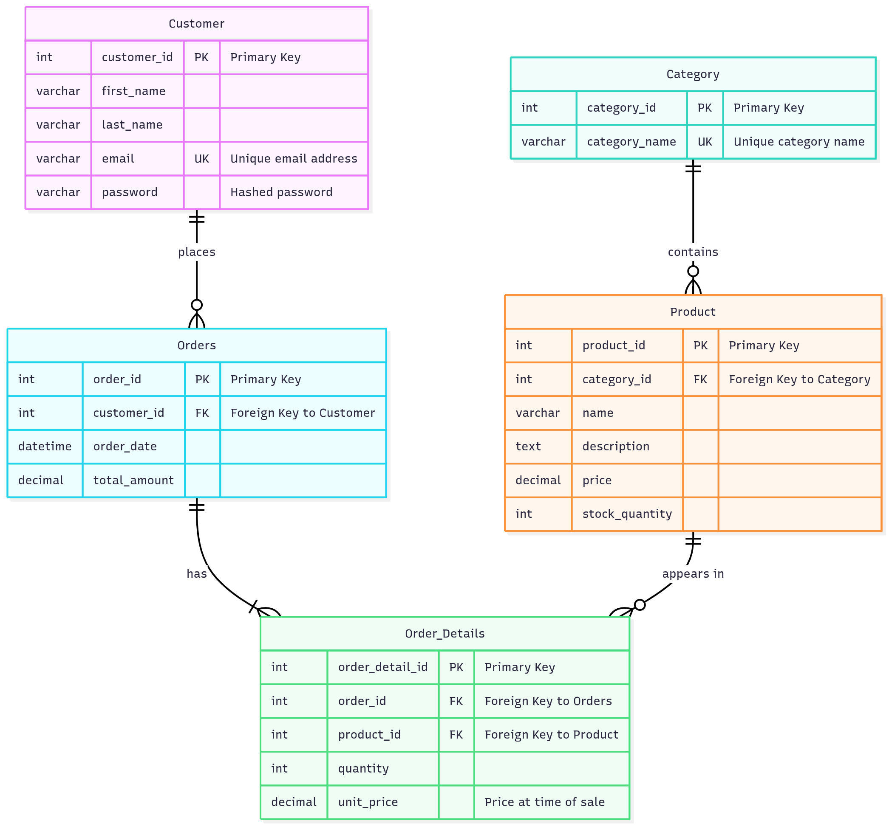

# E-commerce Database Project

This document outlines the database schema, relationships, and key business-intelligence queries for a sample e-commerce platform. It also includes an exploration of database optimization techniques such as denormalization and an example SQL schema script.

## Table of Contents
- Database Schema
	- 1.1 Entity Descriptions
	- 1.2 SQL Schema Script
- Entity-Relationship (ER) Model
	- 2.1 Relationship Identification
	- 2.2 ER Diagram
- SQL Queries for Business Intelligence
	- 3.1 Daily Revenue Report
	- 3.2 Monthly Top-Selling Products
	- 3.3 High-Value Customers (Past Month)
- Database Optimization: Denormalization
	- 4.1 Concept Overview
	- 4.2 Application Example: Customer and Order Entities

---

## 1. Database Schema

### 1.1 Entity Descriptions
The initial CategoryProduct entity has been correctly normalized into two separate entities: `Category` and `Product`, to maintain a proper relational structure.

- **Category**: Stores product categories.
	- `category_id`: Unique identifier for the category.
	- `category_name`: Name of the category (e.g., 'Electronics', 'Books').

- **Product**: Stores information about individual products.
	- `product_id`: Unique identifier for the product.
	- `category_id`: Foreign key linking to the `Category` table.
	- `name`: Name of the product.
	- `description`: Detailed description of the product.
	- `price`: The selling price of the product.
	- `stock_quantity`: The number of units available in inventory.

- **Customer**: Stores customer account information.
	- `customer_id`: Unique identifier for the customer.
	- `first_name`: Customer's first name.
	- `last_name`: Customer's last name.
	- `email`: Customer's email address (should be unique).
	- `password`: Hashed password for customer authentication.

- **Order**: Stores high-level information about a customer's order. Note: `Order` is a reserved keyword in some SQL dialects; use quoting/backticks or choose an alternative name like `Orders`.
	- `order_id`: Unique identifier for the order.
	- `customer_id`: Foreign key linking to the `Customer` table.
	- `order_date`: The date and time the order was placed.
	- `total_amount`: The total cost of the order.

- **Order_Details**: A junction table that links products to orders, storing details for each item in an order.
	- `order_detail_id`: Unique identifier for the order line item.
	- `order_id`: Foreign key linking to the `Order` table.
	- `product_id`: Foreign key linking to the `Product` table.
	- `quantity`: The number of units of the product purchased in this order.
	- `unit_price`: The price of the product at the time of purchase.

### 1.2 SQL Schema Script
This SQL script creates the tables with appropriate primary keys, foreign keys, and constraints. It is written in a standard SQL dialect (compatible with MySQL, PostgreSQL, etc., with minor syntax adjustments if needed).

```sql
-- =============================================
-- Schema for E-commerce Database
-- =============================================

-- Table for product categories
CREATE TABLE Category (
		category_id INT PRIMARY KEY AUTO_INCREMENT,
		category_name VARCHAR(255) NOT NULL UNIQUE
);

-- Table for products
CREATE TABLE Product (
		product_id INT PRIMARY KEY AUTO_INCREMENT,
		category_id INT,
		name VARCHAR(255) NOT NULL,
		description TEXT,
		price DECIMAL(10, 2) NOT NULL,
		stock_quantity INT NOT NULL DEFAULT 0,
		FOREIGN KEY (category_id) REFERENCES Category(category_id)
);

-- Table for customers
CREATE TABLE Customer (
		customer_id INT PRIMARY KEY AUTO_INCREMENT,
		first_name VARCHAR(100) NOT NULL,
		last_name VARCHAR(100) NOT NULL,
		email VARCHAR(255) NOT NULL UNIQUE,
		password VARCHAR(255) NOT NULL -- Should be a hashed value
);

-- Table for orders
-- Note: if your SQL dialect treats "Order" as a reserved word, use `Orders` or quote the identifier.
CREATE TABLE `Order` (
		order_id INT PRIMARY KEY AUTO_INCREMENT,
		customer_id INT,
		order_date DATETIME NOT NULL DEFAULT CURRENT_TIMESTAMP,
		total_amount DECIMAL(10, 2) NOT NULL,
		FOREIGN KEY (customer_id) REFERENCES Customer(customer_id)
);

-- Junction table for order details, linking Orders and Products
CREATE TABLE Order_Details (
		order_detail_id INT PRIMARY KEY AUTO_INCREMENT,
		order_id INT,
		product_id INT,
		quantity INT NOT NULL,
		unit_price DECIMAL(10, 2) NOT NULL, -- Price at the time of sale
		FOREIGN KEY (order_id) REFERENCES `Order`(order_id),
		FOREIGN KEY (product_id) REFERENCES Product(product_id)
);

-- Add indexes for frequently queried columns to improve performance
CREATE INDEX idx_product_name ON Product(name);
CREATE INDEX idx_customer_email ON Customer(email);
CREATE INDEX idx_order_date ON `Order`(order_date);
```

## 2. Entity-Relationship (ER) Model

### 2.1 Relationship Identification
The relationships between the entities are crucial for maintaining data integrity and are defined by foreign keys.

- **Category → Product**: One-to-Many
	- One Category can have many Products.
	- Each Product belongs to exactly one Category.

- **Customer → Order**: One-to-Many
	- One Customer can place many Orders.
	- Each Order is placed by exactly one Customer.

- **Order → Order_Details**: One-to-Many
	- One Order can consist of many Order_Details line items.
	- Each Order_Details line item belongs to exactly one Order.

- **Product → Order_Details**: One-to-Many
	- One Product can appear in many Order_Details line items across different orders.
	- Each Order_Details line item refers to exactly one Product.

- **Product ↔ Order**: Many-to-Many (implemented via `Order_Details` junction table)

### 2.2 ER Diagram
  <p align="center">
    <picture>
    
    </picture>
    </p>
    </n>

## 3. SQL Queries for Business Intelligence
Below are example queries for common BI needs. Adjust names/quoting for your SQL dialect.

### 3.1 Daily Revenue Report
Summarize total revenue for date.

```sql
SELECT
    DATE(o.order_date) AS report_date,
    SUM(o.total_amount) AS total_revenue
FROM
    orders AS o
WHERE
    DATE(o.order_date) = 'date' -- Replace with your specific date
GROUP BY
    DATE(o.order_date);
```

### 3.2 Monthly Top-Selling Products
List top N products by quantity sold for a given month.

```sql

-- Top 10 products 
SELECT
    od.product_id,
    SUM(od.quantity) AS total_quantity_sold
FROM
    order_details AS od
JOIN
    orders AS o ON od.order_id = o.order_id
WHERE
    YEAR(o.order_date) = Y AND MONTH(o.order_date) = M
GROUP BY
    od.product_id
ORDER BY
    total_quantity_sold DESC
LIMIT 10;


```

### 3.3 High-Value Customers (Past Month)
Customers with the highest spend in the past 30 days.

```sql
SELECT
    c.customer_id,
    c.customer_name,
    SUM(o.total_amount) AS total_spending_past_month
FROM
    customers AS c
JOIN
    orders AS o ON c.customer_id = o.customer_id
WHERE
    o.order_date >= DATEADD(month, -1, GETDATE())
GROUP BY
    c.customer_id, c.customer_name
HAVING
    SUM(o.total_amount) > 500
ORDER BY
    total_spending_past_month DESC;
```

## 4. Database Optimization: Denormalization
4.1. Concept Overview
Normalization is the process of organizing columns and tables in a relational database to minimize data redundancy. The schema provided is well-normalized (specifically, it appears to be in Third Normal Form, 3NF).

Denormalization is the opposite process. It involves intentionally adding redundant data to one or more tables to improve query performance. By reducing the number of complex joins required for read operations, the database can retrieve data much faster.

Advantage: Faster read queries (fewer joins).
Disadvantage: Slower write/update operations, increased storage requirements, and risk of data inconsistency if not managed carefully. It's a trade-off between read performance and write complexity.
4.2. Application Example: Customer and Order Entities
Scenario:
A very common use case is displaying a list of recent orders in a dashboard. For each order, we need to show the customer's name. In our normalized schema, this requires a JOIN between the "Order" and Customer tables.

sql

-- Query in a NORMALIZED schema
SELECT
    o.order_id,
    o.order_date,
    o.total_amount,
    c.first_name,
    c.last_name
FROM
    "Order" o
JOIN
    Customer c ON o.customer_id = c.customer_id
WHERE
    o.order_id IN (101, 102, 103);
If the Order table has millions of records, this join can become a performance bottleneck, especially under high traffic.

Denormalization Strategy:
We can denormalize the schema by adding the customer's name directly to the "Order" table.

"Before" (Normalized Order Table):

asciidoc

order_id | customer_id | order_date | total_amount
---------------------------------------------------
101      | 1           | 2023-10-26 | 150.00
"After" (Denormalized Order Table):
We add customer_name as a redundant column.

sql

-- Modified table structure
ALTER TABLE "Order" ADD COLUMN customer_name VARCHAR(201);
The table would now look like this:

asciidoc

order_id | customer_id | order_date | total_amount | customer_name
---------------------------------------------------------------------
101      | 1           | 2023-10-26 | 150.00       | 'John Doe'
Impact:

Improved Read Performance: The query to fetch orders with customer names now becomes much simpler and faster, as it no longer requires a join.

sql

-- Query in a DENORMALIZED schema (faster)
SELECT
    order_id,
    order_date,
    total_amount,
    customer_name
FROM
    "Order"
WHERE
    order_id IN (101, 102, 103);
Increased Write/Update Complexity (The Trade-off):

On Order Creation: When a new order is created, the application logic must fetch the customer's name and insert it into the new customer_name column in the "Order" table.
On Customer Name Update: If a customer updates their name (e.g., John Doe to Jonathan Doe), a significant problem arises. You must not only update the Customer table but also find and update the customer_name in every single past order associated with that customer. This is a complex and potentially slow operation that can lead to data inconsistency if an update fails midway. This can be managed with database triggers or careful application-level logic, but it adds significant overhead.


